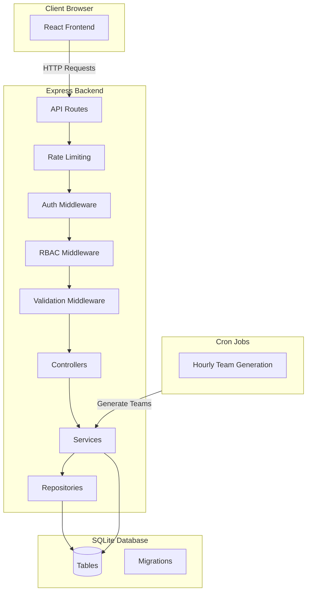
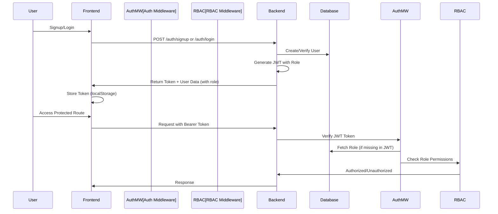
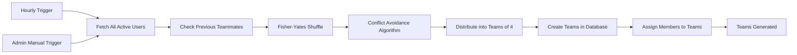
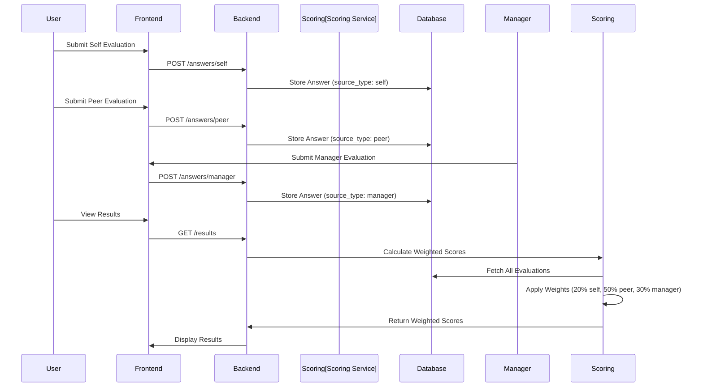
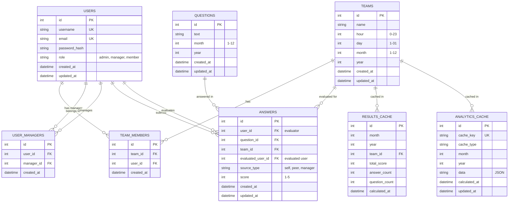

# Team Evaluation System

A comprehensive full-stack web application for team performance evaluation with 360-degree feedback, role-based access control, and hourly team generation. The system supports self-evaluations, peer evaluations, and manager evaluations with weighted scoring to provide comprehensive performance insights.

## Table of Contents

1. [Quick Start](#quick-start)
2. [Project Overview](#project-overview)
3. [Key Features](#key-features)
4. [Architecture](#architecture)
5. [360-Degree Evaluation System](#360-degree-evaluation-system)
6. [Role-Based Access Control (RBAC)](#role-based-access-control-rbac)
7. [Getting Started](#getting-started)
8. [API Documentation](#api-documentation)
9. [Deployment](#deployment)
10. [Known Limitations](#known-limitations)

## Quick Start

### Clone and Setup

```bash
# Clone the repository
git clone https://github.com/amhabibi81/TwoX-PRJ.git
cd TwoX-PRJ/PRJ

# Backend setup
cd backend
npm install
# Create .env file with required variables (see Getting Started section)
npm run dev

# Frontend setup (in new terminal)
cd frontend
npm install
npm run dev
```

### Run Locally

1. **Start Backend** (runs on http://localhost:5000):
   ```bash
   cd PRJ/backend
   npm install
   # Create .env file (see Environment Variables below)
   npm run dev
   ```

2. **Start Frontend** (runs on http://localhost:5173):
   ```bash
   cd PRJ/frontend
   npm install
   npm run dev
   ```

3. **Access Application**: Open http://localhost:5173 in your browser

### Environment Variables

Create a `.env` file in the `PRJ/backend/` directory:

```env
# Required
JWT_SECRET=your-secret-key-must-be-at-least-32-characters-long
PORT=5000
DATABASE_PATH=./data/database.sqlite

# Optional
ADMIN_EMAILS=admin@example.com,admin2@example.com
EVAL_WEIGHT_SELF=0.20
EVAL_WEIGHT_PEER=0.50
EVAL_WEIGHT_MANAGER=0.30
LOG_LEVEL=info
NODE_ENV=development
```

For detailed setup instructions, see the [Getting Started](#getting-started) section.

## Project Overview

The Team Evaluation System is a comprehensive performance evaluation platform that enables organizations to conduct 360-degree evaluations with hourly team assignments. The system automatically generates teams hourly, avoiding previous teammate pairings, and provides a complete evaluation framework with self, peer, and manager feedback.

### Core Capabilities

- **Hourly Team Generation**: Teams are generated on an hourly basis with intelligent conflict avoidance to prevent users from being paired with previous teammates
- **360-Degree Evaluations**: Comprehensive evaluation system supporting self-evaluations, peer evaluations, and manager evaluations
- **Weighted Scoring**: Configurable weighted scoring system (default: 20% self, 50% peer, 30% manager)
- **Role-Based Access Control**: Three-tier RBAC system (admin, manager, member) with centralized authorization
- **Admin Dashboard**: Comprehensive analytics dashboard with participation rates, average scores, top performers, and month-over-month comparisons
- **Manager Relationships**: Flexible manager-employee relationship management for manager evaluations

## Key Features

### Authentication & Authorization

- **Secure Authentication**: JWT-based authentication with password hashing (bcrypt)
- **Role-Based Access Control (RBAC)**: Three roles (admin, manager, member) with hierarchical permissions
- **Token Management**: JWT tokens include user role for efficient authorization
- **Backward Compatibility**: Existing tokens without roles are automatically upgraded

### Team Management

- **Hourly Team Generation**: Teams generated hourly with conflict avoidance algorithm
- **Previous Teammate Avoidance**: Intelligent algorithm prevents pairing users who were teammates in previous hours/days
- **Manual Team Creation**: Admin can manually create teams and manage members
- **Team Member Management**: Add/remove team members with validation
- **Team Scoring**: Real-time team score calculation with weighted evaluations

### 360-Degree Evaluation System

- **Self-Evaluation**: Users evaluate themselves (20% weight, configurable)
- **Peer Evaluation**: Users evaluate all teammates (50% weight, configurable)
- **Manager Evaluation**: Managers evaluate their team members (30% weight, configurable)
- **Weighted Scoring**: Final scores calculated using weighted averages
- **Evaluation Tracking**: Track completion status for each evaluation type
- **Permission Enforcement**: Role-based permissions ensure proper evaluation access

### Admin Dashboard

- **Comprehensive Analytics**: Participation rates, average scores, performance metrics
- **Team Analytics**: Per-team participation rates and average scores
- **User Analytics**: Per-user average scores across all evaluations
- **Top/Bottom Performers**: Identify top 3 and bottom 3 performers
- **Month Comparison**: Month-over-month comparison with change indicators
- **Caching**: Heavy aggregations cached for performance

### Data Management

- **Automatic Migrations**: Database migrations run automatically on server start
- **Result Caching**: Team scores cached for performance
- **Analytics Caching**: Dashboard metrics cached with TTL
- **Data Integrity**: Foreign key constraints and validation ensure data consistency

### Security

- **Rate Limiting**: API rate limiting (100 requests per 15 minutes)
- **Input Validation**: Comprehensive validation using Joi schemas
- **SQL Injection Protection**: Parameterized queries via better-sqlite3
- **Security Headers**: Security headers middleware for protection
- **Authorization Middleware**: Centralized role-based authorization

### User Experience

- **Responsive Design**: Modern UI built with Tailwind CSS
- **Real-time Updates**: Dashboard shows current team scores and rankings
- **Evaluation Status**: Clear indicators for evaluation completion
- **Role-Based UI**: UI elements conditionally rendered based on user role
- **Error Handling**: Comprehensive error handling with user-friendly messages

## Architecture

### Tech Stack

#### Backend
- **Runtime**: Node.js (ES Modules)
- **Framework**: Express.js 4.19
- **Database**: SQLite3 (better-sqlite3 ^12.0.0)
- **Authentication**: JWT (jsonwebtoken), bcrypt
- **Validation**: Joi
- **Security**: express-rate-limit, validator
- **Logging**: Pino (with pino-pretty for development)
- **Scheduling**: node-cron

#### Frontend
- **Framework**: React 18
- **Build Tool**: Vite
- **Styling**: Tailwind CSS
- **Routing**: React Router DOM
- **HTTP Client**: Axios
- **State Management**: React Context API

### System Architecture



### Authentication & Authorization Flow



### Team Generation Workflow



### 360-Degree Evaluation Flow



### Database Schema



## 360-Degree Evaluation System

The system supports comprehensive 360-degree evaluations with three evaluation sources, each contributing to the final weighted score.

### Evaluation Sources

1. **Self-Evaluation** (20% weight, configurable)
   - Users evaluate their own performance
   - Accessible to all authenticated users
   - One evaluation per user per question

2. **Peer Evaluation** (50% weight, configurable)
   - Users evaluate all their teammates
   - Accessible to all authenticated users
   - Multiple evaluations per user (one per teammate)

3. **Manager Evaluation** (30% weight, configurable)
   - Managers evaluate their team members
   - Accessible to users with manager or admin role
   - Requires manager-employee relationship

### Weighted Scoring Formula

The final score for a user on a question is calculated as:

```
weightedScore = (selfScore × 0.20) + (peerAvgScore × 0.50) + (managerScore × 0.30)
```

Where:
- `selfScore`: User's self-evaluation (1-5) or 0 if not submitted
- `peerAvgScore`: Average of all peer evaluations for this user, or 0 if none
- `managerScore`: Manager's evaluation (1-5) or 0 if not submitted

### Configuration

Evaluation weights are configurable via environment variables:

```env
EVAL_WEIGHT_SELF=0.20      # Self-evaluation weight (default: 0.20)
EVAL_WEIGHT_PEER=0.50      # Peer evaluation weight (default: 0.50)
EVAL_WEIGHT_MANAGER=0.30   # Manager evaluation weight (default: 0.30)
```

**Important**: Weights must sum to 1.0 (100%). The system validates this on startup.

### Permission Rules

- **Self Evaluation**: User can only submit for themselves (`evaluatedUserId === userId`)
- **Peer Evaluation**: User can evaluate any teammate in their current team
- **Manager Evaluation**: User must have manager or admin role AND manage the evaluated user (or be admin)

### Backward Compatibility

- Existing peer-only evaluations continue to work
- Old answers default to `source_type='peer'`
- System gracefully handles mix of old and new answer formats
- Old score calculations work if no source_type data exists

## Role-Based Access Control (RBAC)

The system implements a comprehensive RBAC system with three roles and centralized authorization.

### Roles

1. **Admin** (`admin`)
   - Full system access
   - Access to admin dashboard
   - Can submit manager evaluations for any user
   - Can create/manage teams manually
   - Can generate teams manually

2. **Manager** (`manager`)
   - Can submit manager evaluations for users they manage
   - Can view team scores and results
   - Cannot access admin dashboard
   - Cannot create/manage teams manually

3. **Member** (`member`)
   - Default role for all users
   - Can submit self and peer evaluations
   - Can view their team and results
   - Cannot submit manager evaluations
   - Cannot access admin features

### Role Assignment

- **Default Role**: All new users are assigned `member` role
- **Admin Migration**: Users with emails in `ADMIN_EMAILS` are automatically assigned `admin` role on first migration
- **Manager Assignment**: Managers are assigned via the `user_managers` table or by updating user role directly

### Authorization Middleware

The system provides reusable authorization middleware:

- `requireRole(role)`: Require a specific role
- `requireAnyRole(roles[])`: Require any of the specified roles
- `requireAdminOrManager()`: Convenience for admin/manager access

### JWT Token Structure

JWT tokens include role information:

```json
{
  "id": 1,
  "username": "john_doe",
  "email": "john@example.com",
  "role": "admin"
}
```

**Backward Compatibility**: Existing tokens without roles remain valid. The auth middleware fetches the role from the database if missing in the token.

### Permission Matrix

| Feature | Admin | Manager | Member |
|---------|-------|---------|--------|
| Self Evaluation | ✓ | ✓ | ✓ |
| Peer Evaluation | ✓ | ✓ | ✓ |
| Manager Evaluation | ✓ (any user) | ✓ (managed users) | ✗ |
| Admin Dashboard | ✓ | ✗ | ✗ |
| View Teams/Scores | ✓ | ✓ | ✓ |
| Manual Team Creation | ✓ | ✗ | ✗ |
| Team Member Management | ✓ | ✗ | ✗ |

## Getting Started

### Prerequisites

- **Node.js**: v18.x or higher (v20.x recommended for better-sqlite3 compatibility)
- **npm**: v9.x or higher (comes with Node.js)
- **Git**: For cloning the repository

### Environment Variables

Create a `.env` file in the `PRJ/backend/` directory:

```env
# Required
JWT_SECRET=your-secret-key-must-be-at-least-32-characters-long
PORT=5000
DATABASE_PATH=./data/database.sqlite

# Optional - RBAC
ADMIN_EMAILS=admin@example.com,admin2@example.com

# Optional - Evaluation Weights (must sum to 1.0)
EVAL_WEIGHT_SELF=0.20
EVAL_WEIGHT_PEER=0.50
EVAL_WEIGHT_MANAGER=0.30

# Optional - Logging
LOG_LEVEL=info
NODE_ENV=development
```

**Required Variables**:
- `JWT_SECRET`: Secret key for JWT token signing (minimum 32 characters)
- `PORT`: Backend server port (default: 5000)
- `DATABASE_PATH`: Path to SQLite database file (relative or absolute)

**Optional Variables**:
- `ADMIN_EMAILS`: Comma-separated list of admin email addresses (migrated to admin role on first run)
- `EVAL_WEIGHT_SELF`: Self-evaluation weight (default: 0.20)
- `EVAL_WEIGHT_PEER`: Peer evaluation weight (default: 0.50)
- `EVAL_WEIGHT_MANAGER`: Manager evaluation weight (default: 0.30)
- `LOG_LEVEL`: Logging level (debug, info, warn, error)
- `NODE_ENV`: Environment (development, production, test)

### Backend Setup

1. **Navigate to backend directory**:
   ```bash
   cd PRJ/backend
   ```

2. **Install dependencies**:
   ```bash
   npm install
   ```

3. **Create `.env` file**:
   ```bash
   cp .env.example .env  # If you have an example file
   # Or create manually with the variables above
   ```

4. **Start development server**:
   ```bash
   npm run dev
   ```

The server will:
- Automatically run database migrations (including RBAC migration)
- Migrate admin emails from `ADMIN_EMAILS` to admin role
- Seed default questions for the current month
- Start on the port specified in `PORT` (default: 5000)

### Frontend Setup

1. **Navigate to frontend directory**:
   ```bash
   cd PRJ/frontend
   ```

2. **Install dependencies**:
   ```bash
   npm install
   ```

3. **Configure API base URL** (if needed):
   Edit `PRJ/frontend/src/api.js` and update the `baseURL`:
   ```javascript
   const api = axios.create({ baseURL: 'http://localhost:5000' });
   ```

4. **Start development server**:
   ```bash
   npm run dev
   ```

The frontend will start on `http://localhost:5173` (Vite default port).

### Database

The SQLite database is automatically created on first startup. The database file will be located at the path specified in `DATABASE_PATH`.

**Migrations**: Database migrations run automatically on server startup. Migration files are located in `PRJ/backend/src/database/migrations/`.

**Migration Order**:
1. Initial schema (users, teams, questions, answers)
2. Questions month/year support
3. Answers score field
4. Results cache
5. Hour/day fields for teams
6. Analytics cache
7. User managers table
8. 360-degree evaluation fields
9. User roles (RBAC)

**Default Data**: Five default evaluation questions are seeded for the current month on first startup.

### Testing Setup

The backend includes several test scripts:

```bash
# Seed 20 mock users
npm run seed:users

# Create test teams for current hour
npm run test:create-teams

# Add mock scores to teams
npm run test:mock-scores

# Complete setup (seed users + create teams)
npm run test:setup

# Assign user to team
npm run assign:user -- amhabibi81@gmail.com

# Move user to different team
npm run move:user -- userId targetTeamId
```

### Verifying Installation

1. **Backend**: Check `http://localhost:5000` - should return 404 (no root route)
2. **Frontend**: Open `http://localhost:5173` - should show login page
3. **Database**: Check that `database.sqlite` file exists at `DATABASE_PATH`
4. **Migrations**: Check server logs for successful migration messages
5. **RBAC**: Login and verify user has role in JWT token

### Troubleshooting

**Backend won't start**:
- Check that all required environment variables are set
- Verify `JWT_SECRET` is at least 32 characters
- Check that `DATABASE_PATH` directory exists or can be created
- Review logs for specific error messages
- Ensure Node.js version is compatible (v18+ recommended, v20+ for better-sqlite3 ^12.0.0)

**Frontend can't connect to backend**:
- Verify backend is running on the correct port
- Check CORS settings in `PRJ/backend/src/app.js`
- Verify API base URL in `PRJ/frontend/src/api.js`

**Database errors**:
- Ensure write permissions for `DATABASE_PATH` directory
- Check that migrations ran successfully (check logs)
- Verify SQLite3 is properly installed
- Check Node.js version compatibility with better-sqlite3

**Role/Permission issues**:
- Verify user has role assigned in database
- Check that admin emails were migrated correctly
- Ensure JWT token includes role (may need to re-login)

## API Documentation

### Authentication

- `POST /auth/signup` - User registration
  - Body: `{ username, email, password }`
  - Returns: `{ token, user: { id, username, email, role } }`
  - Role: Public

- `POST /auth/login` - User login
  - Body: `{ email, password }`
  - Returns: `{ token, user: { id, username, email, role } }`
  - Role: Public

### Teams

- `GET /teams/my` - Get authenticated user's current team (requires auth)
  - Returns: `{ team: { id, name, hour, day, month, year, members: [...] } }`
  - Role: All authenticated users

- `GET /teams/all-with-scores` - Get all teams with scores for current hour (requires auth)
  - Returns: `{ hour, day, month, year, teams: [...], winner: {...}, userTeamId }`
  - Role: All authenticated users

- `POST /teams/generate` - Generate teams for a month (requires auth)
  - Body: `{ month, year }`
  - Role: All authenticated users

- `POST /teams/admin/generate` - Admin manual team generation (requires auth + admin)
  - Query: `?month=1&year=2024`
  - Role: Admin only

- `POST /teams` - Create team manually (requires auth + admin)
  - Body: `{ name, hour?, day?, month?, year?, memberIds?: [...] }`
  - Role: Admin only

- `POST /teams/:teamId/members` - Add member to team (requires auth + admin)
  - Body: `{ userId }`
  - Role: Admin only

- `DELETE /teams/:teamId/members/:userId` - Remove member from team (requires auth + admin)
  - Role: Admin only

### Questions

- `GET /questions` - Get active questions for current month
  - Returns: `[{ id, text, month, year, created_at }]`
  - Role: Public

- `GET /questions?month=1&year=2024` - Get questions for specific month/year
  - Role: Public

### Answers (360-Degree Evaluations)

- `GET /answers/my` - Get authenticated user's answers (requires auth)
  - Returns: `{ answers: [{ id, question_id, question_text, score, source_type, evaluated_user_id, created_at }], teamId, month, year }`
  - Role: All authenticated users

- `POST /answers` - Submit an answer (supports 360-degree, requires auth)
  - Body: `{ questionId, score, evaluatedUserId?, sourceType? }`
  - Defaults: `sourceType='peer'`, `evaluatedUserId` inferred from team
  - Role: All authenticated users

- `POST /answers/self` - Submit self-evaluation (requires auth)
  - Body: `{ questionId, score }`
  - Role: All authenticated users

- `POST /answers/peer` - Submit peer evaluation (requires auth)
  - Body: `{ questionId, score, evaluatedUserId }`
  - Role: All authenticated users

- `POST /answers/manager` - Submit manager evaluation (requires auth + manager/admin)
  - Body: `{ questionId, score, evaluatedUserId }`
  - Role: Manager or Admin (must manage the user if manager role)

### Results

- `GET /results` - Get results for current month
  - Returns: `{ month, year, cached, calculatedAt, winner: {...}, teamScores: [...] }`
  - Role: All authenticated users

- `GET /results?month=1&year=2024` - Get results for specific month/year
  - Role: All authenticated users

### Admin Dashboard

All admin endpoints require authentication and admin role.

- `GET /admin/dashboard` - Get comprehensive dashboard metrics
  - Query: `?month=1&year=2024`
  - Returns: Aggregated overview with all metrics
  - Role: Admin only

- `GET /admin/dashboard/participation` - Get team participation rates
  - Query: `?month=1&year=2024`
  - Returns: `[{ teamId, teamName, memberCount, submittedAnswers, expectedAnswers, participationRate }]`
  - Role: Admin only

- `GET /admin/dashboard/team-averages` - Get average scores per team
  - Query: `?month=1&year=2024`
  - Returns: `[{ teamId, teamName, averageScore, totalAnswers, totalScore }]`
  - Role: Admin only

- `GET /admin/dashboard/user-averages` - Get average scores per user
  - Query: `?month=1&year=2024`
  - Returns: `[{ userId, username, email, averageScore, totalAnswers, totalScore }]`
  - Role: Admin only

- `GET /admin/dashboard/performers` - Get top/bottom performers
  - Query: `?month=1&year=2024&limit=3`
  - Returns: `{ top: [...], bottom: [...] }`
  - Role: Admin only

- `GET /admin/dashboard/month-comparison` - Get month-over-month comparison
  - Query: `?month=1&year=2024`
  - Returns: `{ currentMonth: {...}, previousMonth: {...}, change: {...} }`
  - Role: Admin only

### Middleware Stack

1. **Security Headers** - Adds security headers to all responses
2. **CORS** - Enables cross-origin requests
3. **Rate Limiting** - General API rate limiting (100 req/15min)
4. **Body Parser** - JSON request parsing
5. **Authentication** - JWT token verification (for protected routes)
6. **Authorization (RBAC)** - Role-based access control (requireRole, requireAnyRole)
7. **Validation** - Input validation using Joi schemas

## Deployment

### Backend Deployment

#### Environment Setup

1. **Set production environment variables**:
   ```env
   NODE_ENV=production
   PORT=5000
   JWT_SECRET=<strong-random-secret-32-chars-min>
   DATABASE_PATH=/var/app/data/database.sqlite
   ADMIN_EMAILS=admin@yourdomain.com
   EVAL_WEIGHT_SELF=0.20
   EVAL_WEIGHT_PEER=0.50
   EVAL_WEIGHT_MANAGER=0.30
   LOG_LEVEL=info
   ```

2. **Install dependencies**:
   ```bash
   npm install --production
   ```

3. **Migrations**: Run automatically on startup

#### Process Management

**Using PM2** (recommended):

```bash
# Install PM2 globally
npm install -g pm2

# Start application
pm2 start PRJ/backend/src/server.js --name team-eval-backend

# Save PM2 configuration
pm2 save

# Setup PM2 to start on system boot
pm2 startup
```

**Using systemd**:

Create `/etc/systemd/system/team-eval-backend.service`:

```ini
[Unit]
Description=Team Evaluation Backend
After=network.target

[Service]
Type=simple
User=www-data
WorkingDirectory=/path/to/PRJ/backend
Environment="NODE_ENV=production"
ExecStart=/usr/bin/node src/server.js
Restart=always

[Install]
WantedBy=multi-user.target
```

Enable and start:
```bash
sudo systemctl enable team-eval-backend
sudo systemctl start team-eval-backend
```

#### Database Backups

SQLite databases should be backed up regularly:

```bash
# Simple backup script
#!/bin/bash
BACKUP_DIR="/var/backups/team-eval"
DATE=$(date +%Y%m%d_%H%M%S)
cp /var/app/data/database.sqlite "$BACKUP_DIR/database_$DATE.sqlite"
# Keep only last 30 days
find "$BACKUP_DIR" -name "database_*.sqlite" -mtime +30 -delete
```

### Frontend Deployment

#### Build Process

1. **Build for production**:
   ```bash
   cd PRJ/frontend
   npm run build
   ```

2. **Build output**: The `dist/` directory contains the production build

#### Static Hosting Options

**Nginx**:

```nginx
server {
    listen 80;
    server_name yourdomain.com;
    root /path/to/PRJ/frontend/dist;
    index index.html;

    location / {
        try_files $uri $uri/ /index.html;
    }

    # API proxy
    location /api {
        proxy_pass http://localhost:5000;
        proxy_http_version 1.1;
        proxy_set_header Upgrade $http_upgrade;
        proxy_set_header Connection 'upgrade';
        proxy_set_header Host $host;
        proxy_cache_bypass $http_upgrade;
    }
}
```

**Vercel/Netlify**:
- Connect your repository
- Set build command: `cd PRJ/frontend && npm run build`
- Set output directory: `PRJ/frontend/dist`
- Configure environment variables if needed

### Production Considerations

#### Security

- **HTTPS**: Use reverse proxy (Nginx) with SSL certificates
- **Rate Limiting**: Already configured (adjust limits if needed)
- **Security Headers**: Already configured
- **Input Validation**: All inputs validated using Joi schemas
- **SQL Injection**: Protected via parameterized queries
- **RBAC**: Centralized authorization prevents unauthorized access

#### Logging

- **Development**: Pretty-printed logs (pino-pretty)
- **Production**: JSON logs for log aggregation tools
- **Log Rotation**: Configure log rotation for production
- **Monitoring**: Set up log monitoring and alerting

#### Performance

- **Database**: SQLite is suitable for moderate traffic. Consider PostgreSQL for high-traffic scenarios
- **Caching**: Results and analytics are cached for performance
- **Connection Pooling**: SQLite handles connections efficiently

#### Scaling Considerations

- **Horizontal Scaling**: SQLite doesn't support multiple writers. Use PostgreSQL for multi-instance deployments
- **Load Balancing**: Not recommended with SQLite. Use PostgreSQL for load-balanced setups
- **Database Replication**: Not supported with SQLite. Migrate to PostgreSQL for replication

## Known Limitations

### Current Constraints

1. **SQLite Database**:
   - Single-writer limitation (not suitable for high-concurrency writes)
   - No built-in replication
   - Limited to single-server deployments
   - File-based (backup requires file system access)

2. **Authentication**:
   - No password reset functionality
   - No email verification
   - No two-factor authentication
   - JWT tokens stored in localStorage (XSS vulnerability)

3. **Team Management**:
   - Teams are generated hourly (not real-time)
   - Manual team regeneration requires admin access
   - Team member removal requires admin access

4. **Notifications**:
   - No email notifications
   - No in-app notifications
   - No reminders for incomplete evaluations

5. **Real-time Features**:
   - No WebSocket support
   - No real-time updates
   - Results require page refresh

6. **Data Export**:
   - No CSV/Excel export functionality
   - Limited reporting capabilities

### Future Improvements

1. **Database Migration**:
   - Migrate to PostgreSQL for production scalability
   - Support for database replication
   - Connection pooling

2. **Enhanced Authentication**:
   - Password reset flow with email verification
   - Email verification on signup
   - Two-factor authentication (2FA)
   - OAuth integration (Google, GitHub)

3. **Enhanced Features**:
   - Custom evaluation questions per month
   - Advanced analytics and reporting
   - Data export (CSV, Excel, PDF)
   - Historical trend analysis
   - Goals/OKRs integration

4. **Notifications**:
   - Email notifications for team assignments
   - Reminder emails for incomplete evaluations
   - Results announcement emails

5. **Real-time Updates**:
   - WebSocket support for live updates
   - Real-time evaluation progress
   - Live results updates

6. **Security Enhancements**:
   - HTTP-only cookies for JWT storage
   - Content Security Policy (CSP)
   - Audit logging

7. **Performance**:
   - Redis caching layer
   - Database query optimization
   - CDN for static assets
   - API response compression

## License

[Specify your license here]

## Contributing

[Add contribution guidelines if applicable]

## Support

For issues and questions, please create an issue in the [GitHub repository](https://github.com/amhabibi81/TwoX-PRJ).
