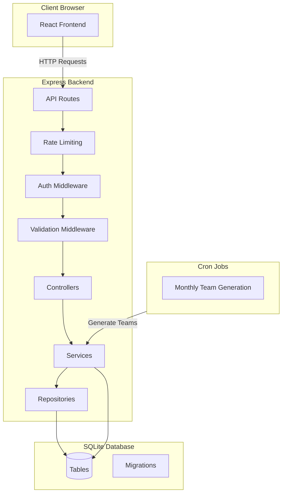
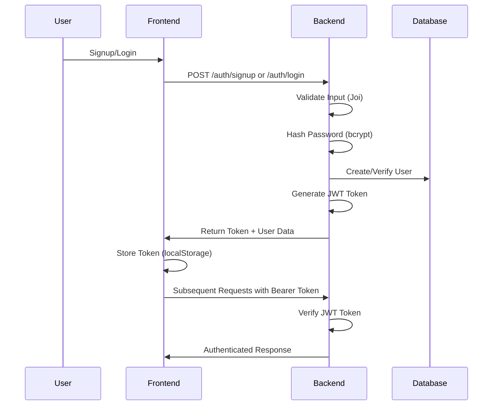
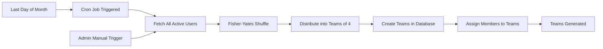
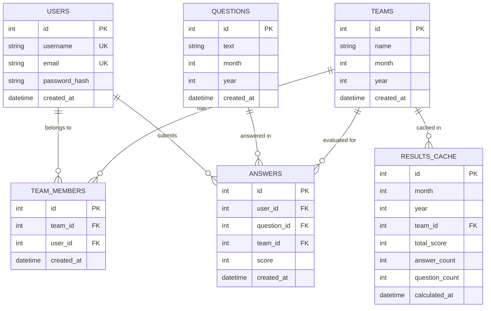

# Team Evaluation System

A full-stack web application for monthly team performance evaluation. Users are automatically assigned to teams each month, evaluate their team members using standardized questions, and view aggregated results with winner determination.

## Table of Contents

1. [Quick Start](#quick-start)
2. [Project Overview](#project-overview)
3. [Architecture](#architecture)
4. [AI-Driven Development Workflow](#ai-driven-development-workflow)
5. [Prompt-Based Development](#prompt-based-development)
6. [Getting Started](#getting-started)
7. [Deployment](#deployment)
8. [Known Limitations](#known-limitations)

## Quick Start

### Clone and Setup

```bash
# Clone the repository
   git clone https://github.com/amhabibi81/TwoX-PRJ.git
cd team-evaluation-system

# Backend setup
cd backend
npm install
# Create .env file with required variables (see Getting Started section)
npm run dev

# Frontend setup (in new terminal)
cd frontend
npm install
npm run dev
```

### Run Locally

1. **Start Backend** (runs on http://localhost:5000):
   ```bash
   cd backend
   npm install
   # Create .env file (see Environment Variables below)
   npm run dev
   ```

2. **Start Frontend** (runs on http://localhost:5173):
   ```bash
   cd frontend
   npm install
   npm run dev
   ```

3. **Access Application**: Open http://localhost:5173 in your browser

### Environment Variables

Create a `.env` file in the `backend/` directory:

```env
JWT_SECRET=your-secret-key-must-be-at-least-32-characters-long
PORT=5000
DATABASE_PATH=./data/database.sqlite
```

For detailed setup instructions, see the [Getting Started](#getting-started) section.

## Project Overview

The Team Evaluation System is designed to facilitate monthly team performance assessments. The application automatically generates teams of 4 members (with flexible sizing for remainder users), provides evaluation forms for team members to rate each other, and calculates aggregated scores to determine winning teams.

### Key Features

- **User Authentication**: Secure signup and login with JWT tokens and password hashing
- **Automated Team Generation**: Monthly team creation using Fisher-Yates shuffle algorithm
- **Evaluation Forms**: Standardized questions with 1-5 rating scale
- **Results Calculation**: Aggregated team scores with tie-breaking logic
- **Admin Controls**: Manual team generation endpoints for testing and administration
- **Structured Logging**: Comprehensive event logging using Pino
- **Security**: Rate limiting, input validation, sanitization, and security headers

### Use Case

This system is ideal for organizations that need to:
- Regularly evaluate team performance
- Ensure fair team distribution
- Track evaluation trends over time
- Identify top-performing teams based on peer feedback

## Architecture

### Tech Stack

#### Backend
- **Runtime**: Node.js (ES Modules)
- **Framework**: Express.js 4.19
- **Database**: SQLite3 (better-sqlite3)
- **Authentication**: JWT (jsonwebtoken), bcrypt
- **Validation**: Joi
- **Security**: express-rate-limit, validator
- **Logging**: Pino (with pino-pretty for development)
- **Scheduling**: node-cron

#### Frontend
- **Framework**: React 18
- **Build Tool**: Vite
- **Styling**: Tailwind CSS
- **Routing**: React Router DOM
- **HTTP Client**: Axios
- **State Management**: React Context API

### System Architecture



### Authentication Flow



### Team Generation Workflow



### Database Schema



### API Endpoints

#### Authentication
- `POST /auth/signup` - User registration
- `POST /auth/login` - User login

#### Teams
- `GET /teams/my` - Get authenticated user's current team (requires auth)
- `POST /teams/generate` - Generate teams for a month (requires auth)
- `POST /teams/admin/generate` - Admin manual team generation (requires auth + admin)

#### Questions
- `GET /questions` - Get active questions for current month
- `GET /questions?month=1&year=2024` - Get questions for specific month/year

#### Answers
- `GET /answers/my` - Get authenticated user's answers (requires auth)
- `POST /answers` - Submit an answer (requires auth)

#### Results
- `GET /results` - Get results for current month
- `GET /results?month=1&year=2024` - Get results for specific month/year

### Middleware Stack

1. **Security Headers** - Adds security headers to all responses
2. **CORS** - Enables cross-origin requests
3. **Rate Limiting** - General API rate limiting (100 req/15min)
4. **Body Parser** - JSON request parsing
5. **Authentication** - JWT token verification (for protected routes)
6. **Validation** - Input validation using Joi schemas
7. **Admin** - Admin access verification (for admin routes)

## AI-Driven Development Workflow

This project was developed using **Cursor AI**, an AI-powered code editor that enables rapid, iterative development through natural language prompts. The entire codebase was built through a collaborative process between the developer and AI assistant.

### Development Approach

1. **Feature Request**: Developer describes desired functionality in natural language
2. **Plan Generation**: AI creates a detailed implementation plan with todos
3. **Code Generation**: AI implements features according to the plan
4. **Iteration**: Developer reviews and refines through additional prompts
5. **Refinement**: Code is cleaned, tested, and optimized iteratively

### Benefits

- **Rapid Prototyping**: Features can be implemented quickly from high-level descriptions
- **Consistent Patterns**: AI maintains consistent code style and architecture
- **Comprehensive Implementation**: AI handles edge cases and error handling
- **Documentation**: Code includes inline comments and structured logging
- **Best Practices**: AI applies security, validation, and architectural best practices

## Prompt-Based Development

### How It Works

Features were developed through a series of prompts, each building upon previous work:

1. **Initial Setup**: "Implement a real database layer using SQLite..."
2. **Authentication**: "Replace fake auth with real authentication..."
3. **Team Generation**: "Implement real monthly team generation logic..."
4. **Evaluation System**: "Implement answer submission logic..."
5. **Results**: "Implement score aggregation and winner selection..."
6. **Frontend**: "Implement full auth flow in React..."
7. **Security**: "Harden the app: input validation, rate limiting..."
8. **Logging**: "Add structured logging for auth events, team generation..."
9. **Refactoring**: "Refactor and clean the entire codebase..."

### Example: Team Generation Feature

**Prompt**: "Implement real monthly team generation logic. Rules: - Fetch all active users - Shuffle randomly - Create teams of 4 (last team can have 3–5) - Store month/year - Prevent regenerating teams for the same month - Return created teams"

**AI Response**:
1. Created plan with specific todos
2. Implemented Fisher-Yates shuffle algorithm
3. Built team distribution logic
4. Added validation and error handling
5. Integrated with database repositories
6. Added structured logging

**Result**: Fully functional team generation service with proper error handling, validation, and logging.

### Plan-Driven Implementation

Each feature follows this workflow:

```
User Prompt → Plan Creation → Todo List → Implementation → Verification
```

Plans are stored in `.cursor/plans/` directory and include:
- Current state analysis
- Implementation steps
- Files to create/modify
- Testing considerations
- Security considerations

## Getting Started

### Prerequisites

- **Node.js**: v18.x or higher
- **npm**: v9.x or higher (comes with Node.js)
- **Git**: For cloning the repository

### Environment Variables

Create a `.env` file in the `backend/` directory:

```env
# Required
JWT_SECRET=your-secret-key-must-be-at-least-32-characters-long
PORT=5000
DATABASE_PATH=./data/database.sqlite

# Optional
ADMIN_EMAILS=admin@example.com,admin2@example.com
LOG_LEVEL=info
NODE_ENV=development
```

**Required Variables**:
- `JWT_SECRET`: Secret key for JWT token signing (minimum 32 characters)
- `PORT`: Backend server port (default: 5000)
- `DATABASE_PATH`: Path to SQLite database file (relative or absolute)

**Optional Variables**:
- `ADMIN_EMAILS`: Comma-separated list of admin email addresses
- `LOG_LEVEL`: Logging level (debug, info, warn, error)
- `NODE_ENV`: Environment (development, production, test)

### Backend Setup

1. **Navigate to backend directory**:
   ```bash
   cd backend
   ```

2. **Install dependencies**:
   ```bash
   npm install
   ```

3. **Create `.env` file**:
   ```bash
   cp .env.example .env  # If you have an example file
   # Or create manually with the variables above
   ```

4. **Start development server**:
   ```bash
   npm run dev
   ```

The server will:
- Automatically run database migrations
- Seed default questions for the current month
- Start on the port specified in `PORT` (default: 5000)
- Set up cron job for monthly team generation

### Frontend Setup

1. **Navigate to frontend directory**:
   ```bash
   cd frontend
   ```

2. **Install dependencies**:
   ```bash
   npm install
   ```

3. **Configure API base URL** (if needed):
   Edit `frontend/src/api.js` and update the `baseURL`:
   ```javascript
   const api = axios.create({ baseURL: 'http://localhost:5000' });
   ```

4. **Start development server**:
   ```bash
   npm run dev
   ```

The frontend will start on `http://localhost:5173` (Vite default port).

### Database

The SQLite database is automatically created on first startup. The database file will be located at the path specified in `DATABASE_PATH`.

**Migrations**: Database migrations run automatically on server startup. Migration files are located in `backend/src/database/migrations/`.

**Default Data**: Five default evaluation questions are seeded for the current month on first startup.

### Verifying Installation

1. **Backend**: Check `http://localhost:5000` - should return 404 (no root route)
2. **Frontend**: Open `http://localhost:5173` - should show login page
3. **Database**: Check that `database.sqlite` file exists at `DATABASE_PATH`

### Troubleshooting

**Backend won't start**:
- Check that all required environment variables are set
- Verify `JWT_SECRET` is at least 32 characters
- Check that `DATABASE_PATH` directory exists or can be created
- Review logs for specific error messages

**Frontend can't connect to backend**:
- Verify backend is running on the correct port
- Check CORS settings in `backend/src/app.js`
- Verify API base URL in `frontend/src/api.js`

**Database errors**:
- Ensure write permissions for `DATABASE_PATH` directory
- Check that migrations ran successfully (check logs)
- Verify SQLite3 is properly installed

## Deployment

### Backend Deployment

#### Environment Setup

1. **Set production environment variables**:
   ```env
   NODE_ENV=production
   PORT=5000
   JWT_SECRET=<strong-random-secret-32-chars-min>
   DATABASE_PATH=/var/app/data/database.sqlite
   ADMIN_EMAILS=admin@yourdomain.com
   LOG_LEVEL=info
   ```

2. **Install dependencies**:
   ```bash
   npm install --production
   ```

3. **Run migrations** (migrations run automatically on startup, but you can verify):
   ```bash
   # Migrations run automatically, but verify database is accessible
   ```

#### Process Management

**Using PM2** (recommended):

```bash
# Install PM2 globally
npm install -g pm2

# Start application
pm2 start backend/src/server.js --name team-eval-backend

# Save PM2 configuration
pm2 save

# Setup PM2 to start on system boot
pm2 startup
```

**Using systemd**:

Create `/etc/systemd/system/team-eval-backend.service`:

```ini
[Unit]
Description=Team Evaluation Backend
After=network.target

[Service]
Type=simple
User=www-data
WorkingDirectory=/path/to/backend
Environment="NODE_ENV=production"
ExecStart=/usr/bin/node src/server.js
Restart=always

[Install]
WantedBy=multi-user.target
```

Enable and start:
```bash
sudo systemctl enable team-eval-backend
sudo systemctl start team-eval-backend
```

#### Cron Job Considerations

The application includes a cron job that runs daily at 11:59 PM UTC to check if it's the last day of the month and generate teams for the next month. Ensure:

1. Server timezone is set correctly (UTC recommended)
2. Process manager (PM2/systemd) restarts the application on failure
3. Logs are monitored for cron job execution

#### Database Backups

SQLite databases should be backed up regularly:

```bash
# Simple backup script
#!/bin/bash
BACKUP_DIR="/var/backups/team-eval"
DATE=$(date +%Y%m%d_%H%M%S)
cp /var/app/data/database.sqlite "$BACKUP_DIR/database_$DATE.sqlite"
# Keep only last 30 days
find "$BACKUP_DIR" -name "database_*.sqlite" -mtime +30 -delete
```

### Frontend Deployment

#### Build Process

1. **Build for production**:
   ```bash
   cd frontend
   npm run build
   ```

2. **Build output**: The `dist/` directory contains the production build

#### Static Hosting Options

**Nginx**:

```nginx
server {
    listen 80;
    server_name yourdomain.com;
    root /path/to/frontend/dist;
    index index.html;

    location / {
        try_files $uri $uri/ /index.html;
    }

    # API proxy
    location /api {
        proxy_pass http://localhost:5000;
        proxy_http_version 1.1;
        proxy_set_header Upgrade $http_upgrade;
        proxy_set_header Connection 'upgrade';
        proxy_set_header Host $host;
        proxy_cache_bypass $http_upgrade;
    }
}
```

**Vercel/Netlify**:
- Connect your repository
- Set build command: `cd frontend && npm run build`
- Set output directory: `frontend/dist`
- Configure environment variables if needed

**Docker** (optional):

```dockerfile
# Backend Dockerfile
FROM node:18-alpine
WORKDIR /app
COPY backend/package*.json ./
RUN npm install --production
COPY backend/ .
EXPOSE 5000
CMD ["node", "src/server.js"]
```

### Production Considerations

#### Security

- **HTTPS**: Use reverse proxy (Nginx) with SSL certificates
- **Rate Limiting**: Already configured (adjust limits in `rateLimit.middleware.js` if needed)
- **Security Headers**: Already configured in `security.middleware.js`
- **Input Validation**: All inputs validated using Joi schemas
- **SQL Injection**: Protected via parameterized queries (better-sqlite3)

#### Logging

- **Development**: Pretty-printed logs (pino-pretty)
- **Production**: JSON logs for log aggregation tools
- **Log Rotation**: Configure log rotation for production
- **Monitoring**: Set up log monitoring and alerting

#### Performance

- **Database**: SQLite is suitable for moderate traffic. Consider PostgreSQL for high-traffic scenarios
- **Caching**: Results are cached per month in `results_cache` table
- **Connection Pooling**: SQLite handles connections efficiently

#### Scaling Considerations

- **Horizontal Scaling**: SQLite doesn't support multiple writers. Use PostgreSQL for multi-instance deployments
- **Load Balancing**: Not recommended with SQLite. Use PostgreSQL for load-balanced setups
- **Database Replication**: Not supported with SQLite. Migrate to PostgreSQL for replication

## Known Limitations

### Current Constraints

1. **SQLite Database**:
   - Single-writer limitation (not suitable for high-concurrency writes)
   - No built-in replication
   - Limited to single-server deployments
   - File-based (backup requires file system access)

2. **Authentication**:
   - No password reset functionality
   - No email verification
   - No two-factor authentication
   - JWT tokens stored in localStorage (XSS vulnerability)

3. **Admin System**:
   - Admin access controlled via email list only
   - No role-based access control (RBAC)
   - No admin dashboard UI
   - Admin emails must be configured via environment variables

4. **Team Management**:
   - Teams cannot be regenerated for the same month (by design)
   - No team member removal functionality
   - No team modification after creation
   - Manual team regeneration requires admin access

5. **Notifications**:
   - No email notifications
   - No in-app notifications
   - No reminders for incomplete evaluations

6. **Real-time Features**:
   - No WebSocket support
   - No real-time updates
   - Results require page refresh

7. **Data Export**:
   - No CSV/Excel export functionality
   - No reporting dashboard
   - Limited analytics

### Future Improvements

1. **Database Migration**:
   - Migrate to PostgreSQL for production scalability
   - Support for database replication
   - Connection pooling

2. **Enhanced Authentication**:
   - Password reset flow with email verification
   - Email verification on signup
   - Two-factor authentication (2FA)
   - OAuth integration (Google, GitHub)

3. **Role-Based Access Control**:
   - Multiple admin roles
   - Permission system
   - Admin dashboard UI

4. **Notifications**:
   - Email notifications for team assignments
   - Reminder emails for incomplete evaluations
   - Results announcement emails

5. **Enhanced Features**:
   - Team member management (add/remove)
   - Custom evaluation questions per month
   - Advanced analytics and reporting
   - Data export (CSV, Excel, PDF)
   - Historical trend analysis

6. **Real-time Updates**:
   - WebSocket support for live updates
   - Real-time evaluation progress
   - Live results updates

7. **Security Enhancements**:
   - HTTP-only cookies for JWT storage
   - Content Security Policy (CSP)
   - API key authentication for admin endpoints
   - Audit logging

8. **Performance**:
   - Redis caching layer
   - Database query optimization
   - CDN for static assets
   - API response compression

## License

[Specify your license here]

## Contributing

[Add contribution guidelines if applicable]

## Support

For issues and questions, please [create an issue in the repository / contact support].
